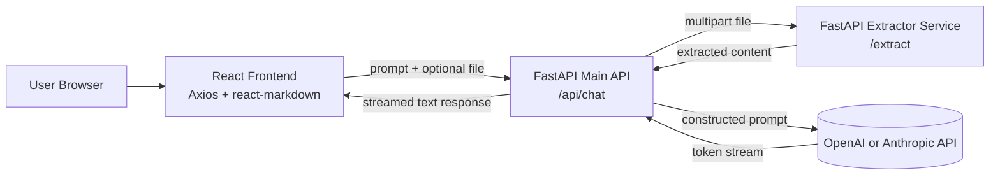

# Architecture Diagram

## Brief Notes

- The frontend sends prompt and optional file in one request.
- The main API calls an internal extraction microservice before invoking the LLM.
- The final LLM response is streamed back to the frontend for progressive rendering.

